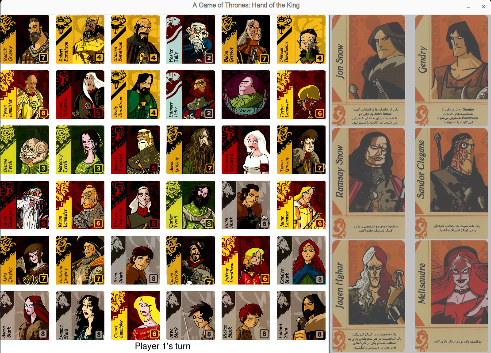

# **GOT: Hand of the King**  

#### **1. Game Overview and Rules**  
*Hand of the King* is a two-player strategic game where players compete to collect cards from the board, each representing different noble houses. The goal is to claim as many houses as possible, and the player who controls the majority of houses by the end of the game wins.


#### **2. AI Implementation**  
In this project, we developed an intelligent game-playing agent by combining **Minimax tree search with Alpha-Beta Pruning** and **Reinforcement Learning (RL).** Instead of using a handcrafted heuristic function, we trained an RL model to **learn an optimal evaluation function** for Minimax. This allowed the agent to dynamically improve its decision-making based on experience.  

- **Reinforcement Learning (RL)** trains a model to optimize the evaluation function for analyzing game states.  
- **Minimax Algorithm with Alpha-Beta Pruning** reduces computational complexity and improves search efficiency.  
- **Enhanced strategic decision-making** through a combination of classical AI techniques and modern learning-based heuristics. 
- **The model is capable of analyzing the game state and selecting the best possible move within a maximum of 10 seconds.**

This hybrid approach enables the agent not only to make intelligent moves but also to improve its performance over time by optimizing its evaluation function.  

## **Setup & Usage**  
### **Requirements**  
- Python 3.9 or higher  

### **Installation**  
1. Clone the repository:  
   ```bash
   git clone https://github.com/engineerMrezai/hand-of-the-king.git
   cd hand-of-the-king
   ```  
2. Install dependencies:  
   ```bash
   pip install pygame json argparse
   ```  

### **Training the RL Heuristic Model**  
To train the RL agent and optimize its heuristic function:  
```bash
python train.py
```  

### **Playing the Game**  
To start a game, use the following command:  
```bash
python main.py --player1 "rebel_agent" --player2 human
```   


### **Acknowledgments**  
This project was inspired by [Hand-of-the-King](https://github.com/Mohammad-Momeni/Hand-of-the-King).  
Special thanks to **Dr. Salimi Badr** for guidance in the **Fundamentals of AI course.**  

### **Development Team**  
**AI Rebels**  
- **Mahdi Rezai**  
- **Nila Chenari**  


